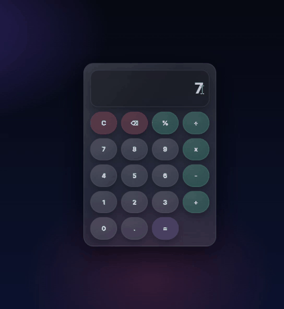

📱 Projeto: Calculator JS

Este é um projeto pessoal desenvolvido com o objetivo de treinar algoritmo e lógica de programação, focando em entender como funciona a lógica interna de uma calculadora real, desde a entrada de dados até o cálculo e exibição dos resultados.

O projeto foi construído utilizando as tecnologias HTML, CSS e JavaScript, com atenção especial à organização do código, clareza das funções e experiência do usuário.

Durante o desenvolvimento, busquei pesquisar e compreender como a lógica de uma calculadora funciona de verdade, estudando cada etapa do processo para não apenas “fazer funcionar”, mas entender o porquê de cada decisão no código. Foi um projeto desafiador, que exigiu bastante raciocínio, testes, erros, correções e aprendizado contínuo.

🧠 Lógica e funções utilizadas

Para manter o código organizado e legível, a aplicação foi estruturada em várias funções, cada uma com uma responsabilidade específica, como por exemplo:

atualizarDisplay() → Atualiza o visor da calculadora conforme o usuário interage

inputNumero() → Insere números digitados no display

inputDecimal() → Controla a inserção do ponto decimal

limparTudo() → Limpa completamente a calculadora

retroceder() → Apaga o último dígito inserido

tratarOperador() → Trata os operadores matemáticos (+, −, ×, ÷)

calcular() → Executa o cálculo final

identificadorIgual() → Identifica o operador “=” e retorna o resultado

formatarResultado() → Formata o valor exibido no display

Para garantir resultados mais precisos, foi utilizado o método Math.round(), responsável por arredondar valores para o número inteiro mais próximo, melhorando a apresentação dos resultados.

⚙️ Recursos de JavaScript aplicados

Uso de operadores ternários (? :) para substituir estruturas if / else simples, deixando o código mais limpo e objetivo

Utilização de arrow functions (=>), aplicando uma sintaxe moderna do JavaScript

Implementação do addEventListener, que atua como um ouvinte de eventos, chamando as funções corretas sempre que um botão é clicado

Conversão de strings para números, garantindo que os cálculos matemáticos funcionem corretamente

⌨️ Suporte a teclado físico

Além da interface visual, a calculadora conta com suporte completo ao teclado físico, permitindo que o usuário digite diretamente pelo computador.

Esse recurso foi implementado utilizando:

document.addEventListener('keydown')

Evento keydown, que detecta quando uma tecla é pressionada

Mapeamento das teclas físicas para os botões da calculadora, garantindo que números, operadores e ações funcionem tanto no clique quanto na digitação

Para isso, também foi necessário pesquisar como funciona o fluxo de eventos do teclado no JavaScript e como interpretar corretamente cada tecla pressionada.

🚀 Aprendizado e motivação

Este projeto foi extremamente desafiador e importante para minha evolução. Pesquisei sobre cada função da calculadora, sobre Math.round(), sobre eventos de teclado e sobre boas práticas em JavaScript para consolidar meu aprendizado.

Tenho buscado desenvolver projetos práticos porque meu professor Rodolfo Mori sempre reforça a importância de “colocar os dedos no teclado”, gastar tempo codando e errando para realmente aprender lógica de programação.

Durante o processo de desenvolvimento, também contei com o apoio do ChatGPT, que me auxiliou com explicações, revisões de lógica e organização do código, sempre mantendo o foco em aprendizado real.

Este projeto representa mais um passo na minha jornada como desenvolvedor, reforçando que persistência, prática e estudo constante são fundamentais para evoluir na programação.

## 🎬 Demonstração do Projeto

